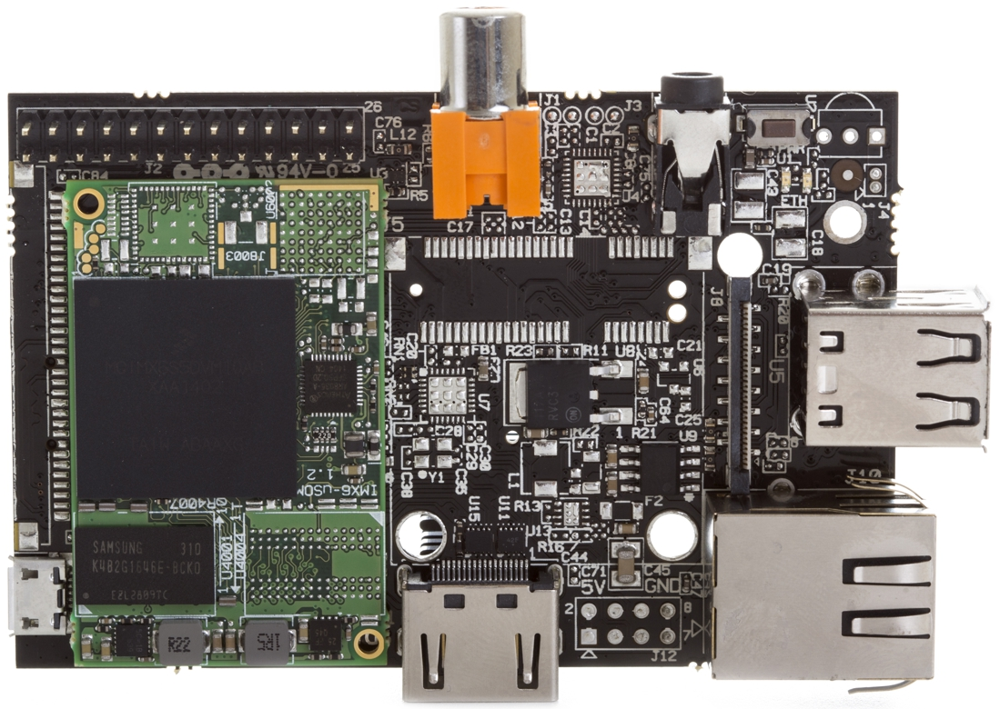

.. |yes| image:: ../../images/yes.png
.. |no| image:: ../../images/no.png

.. role:: underline
   :class: underline

Hummingboard Base / Pro
=======================

+----------------+-----------------+
| System on Chip | NXP IMX6SDLRM   |
+----------------+-----------------+
| Number GPIO    | 17              |
+----------------+-----------------+
| Status         | Fully supported |
+----------------+-----------------+

Supported Features
------------------

+----------------+-----------------+
| Read / Write   | |yes|           |
+----------------+-----------------+
| Interrupt      | |yes|           |
+----------------+-----------------+

Platform Selection
------------------

Due to the SolidRun *System On Module (SOM)* feature, a right combination of platform and SOM needs to be configured to get proper wiringX support for your platform.

+-------------------+--------------------+-----------------------+
| **Platform**      | **SOM**            | **wiringX**           |
+-------------------+--------------------+-----------------------+
| Hummingboard Base | i1 i.MX6 Solo      | hummingboard_base_sdl |
+-------------------+--------------------+-----------------------+
| Hummingboard Pro  | i1 i.MX6 Solo      | hummingboard_pro_sdl  |
+-------------------+--------------------+-----------------------+
| Hummingboard Base | i2 i.MX6 Dual Lite | hummingboard_base_sdl |
+-------------------+--------------------+-----------------------+
| Hummingboard Pro  | i2 i.MX6 Dual Lite | hummingboard_pro_sdl  |
+-------------------+--------------------+-----------------------+
| Hummingboard Base | i2eX i.MX6 Dual    | hummingboard_base_dq  |
+-------------------+--------------------+-----------------------+
| Hummingboard Pro  | i2eX i.MX6 Dual    | hummingboard_pro_dq   |
+-------------------+--------------------+-----------------------+
| Hummingboard Base | i4Pro i.MX6 Quad   | hummingboard_base_dq  |
+-------------------+--------------------+-----------------------+
| Hummingboard Pro  | i4Pro i.MX6 Quad   | hummingboard_pro_dq   |
+-------------------+--------------------+-----------------------+

GPIO Mapping
------------

+----+----+----+----+----+---+----+---+----+----+----+----+----+
| 5v | 5v | 0v | 15 | 16 | 1 | 0v | 4 | 5  | 0v | 6  | 10 | 11 |
+----+----+----+----+----+---+----+---+----+----+----+----+----+
|3.3v| 8  | 9  | 7  | 0v | 0 | 2  | 3 |3.3v| 12 | 13 | 14 | 0v |
+----+----+----+----+----+---+----+---+----+----+----+----+----+
