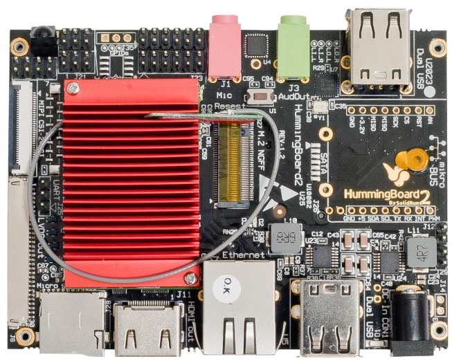

.. |yes| image:: ../../images/yes.png
.. |no| image:: ../../images/no.png

.. role:: underline
   :class: underline

Hummingboard Edge / Gate
========================

+----------------+-----------------+
| System on Chip | NXP IMX6DQRM    |
+----------------+-----------------+
| Number GPIO    | 33              |
+----------------+-----------------+
| Status         | Fully supported |
+----------------+-----------------+

Supported Features
------------------

+----------------+-----------------+
| Read / Write   | |yes|           |
+----------------+-----------------+
| Interrupt      | |yes|           |
+----------------+-----------------+

Platform Selection
------------------

Due to the SolidRun *System On Module (SOM)* feature, a right combination of platform and SOM needs to be configured to get proper wiringX support for your platform.

+-------------------+--------------------+-----------------------+
| **Platform**      | **SOM**            | **wiringX**           |
+-------------------+--------------------+-----------------------+
| Hummingboard Edge | i1 i.MX6 Solo      | hummingboard_edge_sdl |
+-------------------+--------------------+-----------------------+
| Hummingboard Gate | i1 i.MX6 Solo      | hummingboard_gate_sdl |
+-------------------+--------------------+-----------------------+
| Hummingboard Edge | i2 i.MX6 Dual Lite | hummingboard_edge_sdl |
+-------------------+--------------------+-----------------------+
| Hummingboard Gate | i2 i.MX6 Dual Lite | hummingboard_gate_sdl |
+-------------------+--------------------+-----------------------+
| Hummingboard Edge | i2eX i.MX6 Dual    | hummingboard_edge_dq  |
+-------------------+--------------------+-----------------------+
| Hummingboard Gate | i2eX i.MX6 Dual    | hummingboard_gate_dq  |
+-------------------+--------------------+-----------------------+
| Hummingboard Edge | i4Pro i.MX6 Quad   | hummingboard_edge_dq  |
+-------------------+--------------------+-----------------------+
| Hummingboard Gate | i4Pro i.MX6 Quad   | hummingboard_gate_dq  |
+-------------------+--------------------+-----------------------+

GPIO Mapping
------------

+--------+--------+--------+--------+--------+
| ?      | ?      | ?      | ?      | ?      |
+--------+--------+--------+--------+--------+
| ?      | ?      | ?      | ?      | ?      |
+--------+--------+--------+--------+--------+

+--------+--------+--------+
| 31     | **27** | 0v     |
+--------+--------+--------+
|3.3v    | **28** | **24** |
+--------+--------+--------+
| 5v     | **29** | **25** |
+--------+--------+--------+
| 5v     | **30** | **26** |
+--------+--------+--------+

+--------+--------+--------+--------+-------+-------+
| **19** | 15     | 11     | 7      | **3** | **0** |
+--------+--------+--------+--------+-------+-------+
| 20     | 16     | 12     | 8      | **4** | **1** |
+--------+--------+--------+--------+-------+-------+
| 21     | 17     | 13     | 9      | **5** | **2** |
+--------+--------+--------+--------+-------+-------+
| 22     | 18     | 14     | 10     | **6** | 0v    |
+--------+--------+--------+--------+-------+-------+

Only the bold GPIO can be used as interrupt.