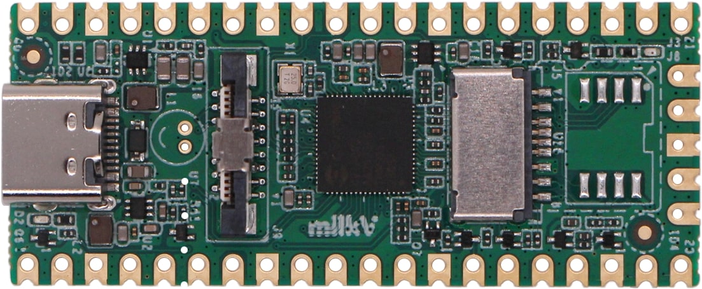

.. |yes| image:: ../../images/yes.png
.. |no| image:: ../../images/no.png

.. role:: underline
   :class: underline

Milk-V Duo
==========

+----------------+-----------------+
| System on Chip | Sophgo CV1800B  |
+----------------+-----------------+
| Number GPIO    | 22              |
+----------------+-----------------+
| Status         | Fully supported |
+----------------+-----------------+

Supported Features
------------------

+----------------+-----------------+
| Read / Write   | |yes|           |
+----------------+-----------------+
| Interrupt      | |yes|           |
+----------------+-----------------+

GPIO Mapping
------------

+----+----+-----+----+----+----+----+-----+----+----+----+----+-----+----+----+----+----+-----+----+----+-----+-----+
|3.3V|3.3V| GND |3.3V|3.3V|3.3V|3.3V| GND | 27 | 26 |3.3V| 22 | GND | 21 | 20 | 19 | 18 | GND | 17 | 16 | N/A | N/A |
+----+----+-----+----+----+----+----+-----+----+----+----+----+-----+----+----+----+----+-----+----+----+-----+-----+
| 0  | 1  | GND | 2  | 3  | 4  | 5  | GND | 6  | 7  | 8  | 9  | GND | 10 | 11 | 12 | 13 | GND | 14 | 15 | N/A | 25  |
+----+----+-----+----+----+----+----+-----+----+----+----+----+-----+----+----+----+----+-----+----+----+-----+-----+

Note: GPIO 25 is also connected to the User LED.
