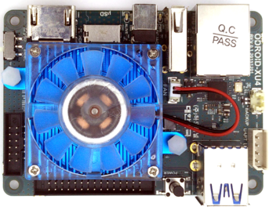

.. |yes| image:: ../../images/yes.png
.. |no| image:: ../../images/no.png

.. role:: underline
   :class: underline

Odroid XU4
==========

+----------------+---------------------+
| System on Chip | Samsung Exynos 5422 |
+----------------+---------------------+
| Number GPIO    | 30                  |
+----------------+---------------------+
| Status         | Fully supported     |
+----------------+---------------------+

Supported Features
------------------

+----------------+-----------------+
| Read / Write   | |yes|           |
+----------------+-----------------+
| Interrupt      | |yes|           |
+----------------+-----------------+

GPIO Mapping
------------

+----+----+
| 37 | 36 |
+----+----+
| 35 | 34 |
+----+----+
| 0v | 33 |
+----+----+
| 31 | 32 |
+----+----+
| 30 | 2v |
+----+----+
| 0v | 5v |
+----+----+

+----+----+----+----+----+----+----+---+----+----+----+----+----+----+----+
| 2v | 27 | 7  | AD | 26 | 22 | 3  | 7 | 2  | 10 | 13 | 12 | 0  | AD | 5v |
+----+----+----+----+----+----+----+---+----+----+----+----+----+----+----+
| 0v | 0v | 6  | 11 | 23 | 21 | 4  | 8 | 9  | PW | 14 | 15 | 16 | 1  | 0v |
+----+----+----+----+----+----+----+---+----+----+----+----+----+----+----+