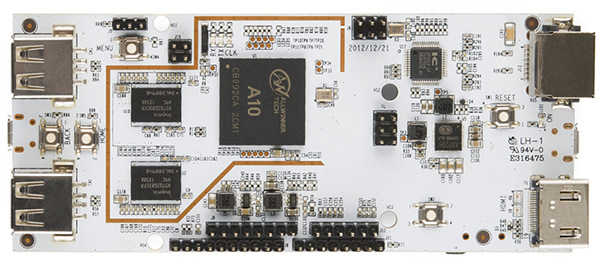

.. |yes| image:: ../../images/yes.png
.. |no| image:: ../../images/no.png

.. role:: underline
   :class: underline

PCDuino 1
=========

+----------------+-----------------+
| System on Chip | Allwinner 10    |
+----------------+-----------------+
| Number GPIO    | 17              |
+----------------+-----------------+
| Status         | Fully supported |
+----------------+-----------------+

Supported Features
------------------

+----------------+-----------------+
| Read / Write   | |yes|           |
+----------------+-----------------+
| Interrupt      | |yes|           |
+----------------+-----------------+
| Analogue       | |no|            |
+----------------+-----------------+

GPIO Mapping
------------

+----+----+----+
|  ? | ?  |  ? |
+----+----+----+

+----+----+----+
|  ? | ?  |  ? |
+----+----+----+
|  ? | ?  |  ? |
+----+----+----+

+----+----+
| 17 | 15 |
+----+----+
| 16 | 14 |
+----+----+

+----+----+
| ?  | ?  |
+----+----+
| ?  | ?  |
+----+----+
| ?  | ?  |
+----+----+

+----+----+----+----+----+----+----+----+----+----+----+----+----+----+
| ?  |  ? | ?  | ?  | ?  | ?  | ?  | ?  | ?  | ?  | ?  | ?  | ?  | ?  |
+----+----+----+----+----+----+----+----+----+----+----+----+----+----+

+----+----+----+----+----+----+----+----+----+----+----+----+----+----+----+----+----+
| ?  |  ? | ?  | ?  | 13 | 12 | 11 | 10 | 9  | 8  | 7  | 5  | 4  | 3  | 2  | 1  | 0  |
+----+----+----+----+----+----+----+----+----+----+----+----+----+----+----+----+----+

Additional
----------

- Green LED: 30
- Blue LED: 31