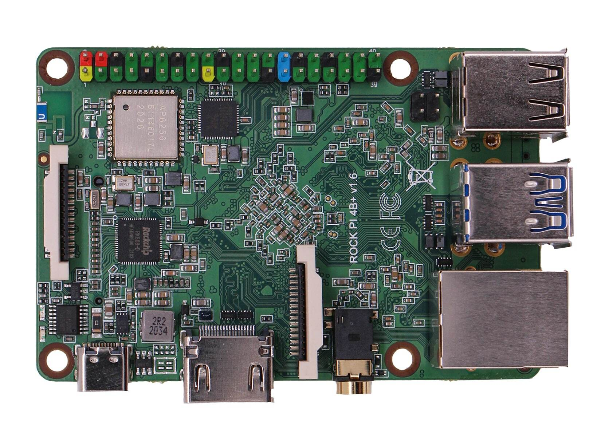

.. |yes| image:: ../../images/yes.png
.. |no| image:: ../../images/no.png

.. role:: underline
   :class: underline

Radxa ROCK 4 Series
===================

+----------------+---------------------------+
| System on Chip | Rockchip RK3399 variants  |
+----------------+---------------------------+
| Number GPIO    | 27                        |
+----------------+---------------------------+
| Status         | Fully supported           |
+----------------+---------------------------+

Following ROCK 4 models are supported:

+-------------+------------------+
| **Model**   | **SoC variants** |
+-------------+------------------+
| ROCK 4A/B/C | Rockchip RK3399  |
+-------------+------------------+
| ROCK 4A+/B+ | Rockchip OP1     |
+-------------+------------------+
| ROCK 4 SE   | Rockchip RK3399T |
+-------------+------------------+
| ROCK 4C+    | Rockchip RK3399T |
+-------------+------------------+

Supported Features
------------------

+----------------+-----------------+
| Read / Write   | |yes|           |
+----------------+-----------------+
| Interrupt      | |yes|           |
+----------------+-----------------+

GPIO Mapping
------------

+----+----+----+----+----+---+----+---+----+----+----+----+----+----+----+-----+----+----+----+----+
| 5v | 5v | 0v | 15 | 16 | 1 | 0v | 4 | 5  | 0v | 6  | 10 |3.3v| 31 | 0v | 26* | 0v | 27 | 28 | 29 |
+----+----+----+----+----+---+----+---+----+----+----+----+----+----+----+-----+----+----+----+----+
|3.3v| 8  | 9  | 7  | 0v | 0 | 2  | 3 |3.3v| 12 | 13 | 14 | 0v | 30 | 21 | 22  | 23 | 24 | 25 | 0v |
+----+----+----+----+----+---+----+---+----+----+----+----+----+----+----+-----+----+----+----+----+

Note: to use GPIO pin 26, the status LED has to be disabled (i.e. LED's trigger set to `none`).
Otherwise, the operation will have no effect and no error will be returned.

This workaround is required on vendor 4.4 kernel.