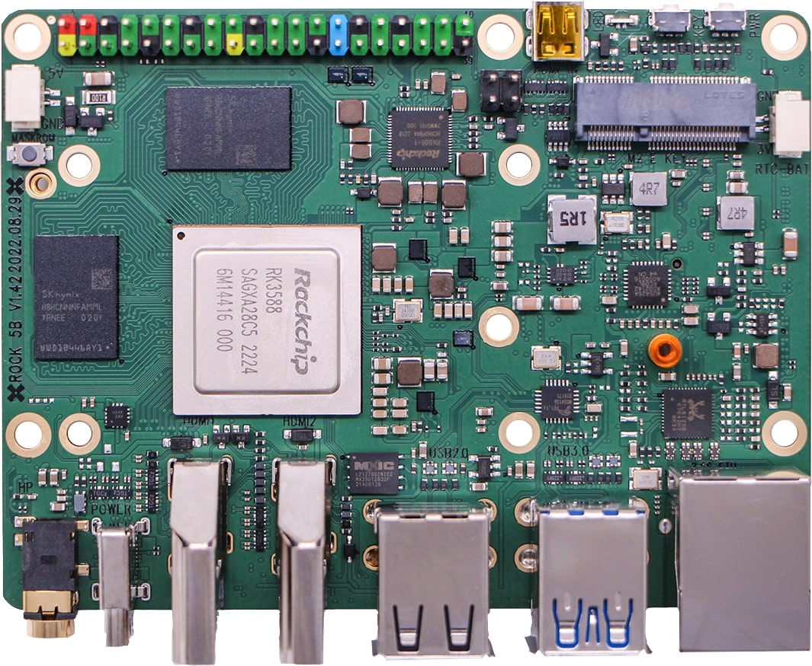

.. |yes| image:: ../../images/yes.png
.. |no| image:: ../../images/no.png

.. role:: underline
   :class: underline

Radxa ROCK 5B
=============

+----------------+-----------------+
| System on Chip | Rockchip RK3588 |
+----------------+-----------------+
| Number GPIO    | 26              |
+----------------+-----------------+
| Status         | Fully supported |
+----------------+-----------------+

Supported Features
------------------

+----------------+-----------------+
| Read / Write   | |yes|           |
+----------------+-----------------+
| Interrupt      | |yes|           |
+----------------+-----------------+

GPIO Mapping
------------

+------+----+-----+----+-----+---+-----+---+------+-----+-----+----+-----+----+-----+----+-----+----+-----+-----+
| 5v   | 5v | GND | 15 | 16  | 1 | GND | 4 | 5    | GND | N/A | 10 | 11  | 31 | GND | 26 | GND | 27 | 28  | 29  |
+------+----+-----+----+-----+---+-----+---+------+-----+-----+----+-----+----+-----+----+-----+----+-----+-----+
| 3.3v | 8  | 9   | 7  | GND | 0 | 2   | 3 | 3.3v | 12  | 13  | 14 | GND | 30 | 21  | 22 | 23  | 24 | N/A | GND |
+------+----+-----+----+-----+---+-----+---+------+-----+-----+----+-----+----+-----+----+-----+----+-----+-----+
