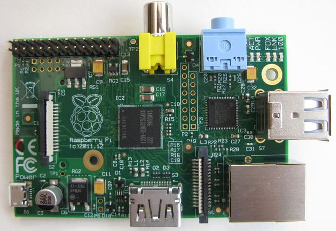

.. |yes| image:: ../../images/yes.png
.. |no| image:: ../../images/no.png

.. role:: underline
   :class: underline

Raspberry Pi 1A and B Revision 2
================================

+----------------+-----------------+
| System on Chip | Broadcom 2835   |
+----------------+-----------------+
| Number GPIO    | 20              |
+----------------+-----------------+
| Status         | Fully supported |
+----------------+-----------------+

Supported Features
------------------

+----------------+-----------------+
| Read / Write   | |yes|           |
+----------------+-----------------+
| Interrupt      | |yes|           |
+----------------+-----------------+

GPIO Mapping
------------

+----+----+----+----+----+---+----+---+----+----+----+----+----+
| 5v | 5v | 0v | 15 | 16 | 1 | 0v | 4 | 5  | 0v | 6  | 10 | 11 |
+----+----+----+----+----+---+----+---+----+----+----+----+----+
|3.3v| 8  | 9  | 7  | 0v | 0 | 2  | 3 |3.3v| 12 | 13 | 14 | 0v |
+----+----+----+----+----+---+----+---+----+----+----+----+----+

+----+----+----+----+
| 5v | 5v | 20 | 0v |
+----+----+----+----+
|3.3v| 17 | 19 | 0v |
+----+----+----+----+
